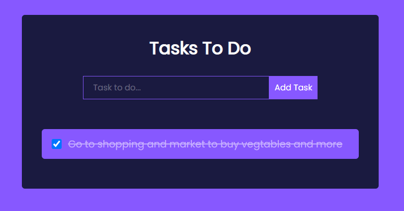
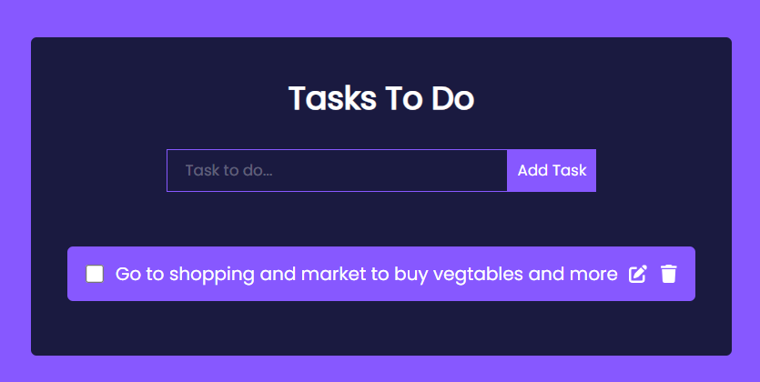

This is simple Todo list app project using react.

To start with this project ,

- cd to the project floder
- Download necessary dependeies by using command `npm i` or `npm install`
- `npm start`
  Runs the app in the development mode.\
  Open [http://localhost:3000](http://localhost:3000) to view it in your browser.

The page will reload when you make changes.\
You may also see any lint errors in the console.

The features impleted in this project are:

1. AddTask : By clicking the the AddTask Button we can Add task to our todo list

2. CheckBox : It used to track the completed tasks.

- If the task is completed, by clicking the checkbox the task is striked by line
  

3. Edit : to update the task

4. Delete : to delete the task

